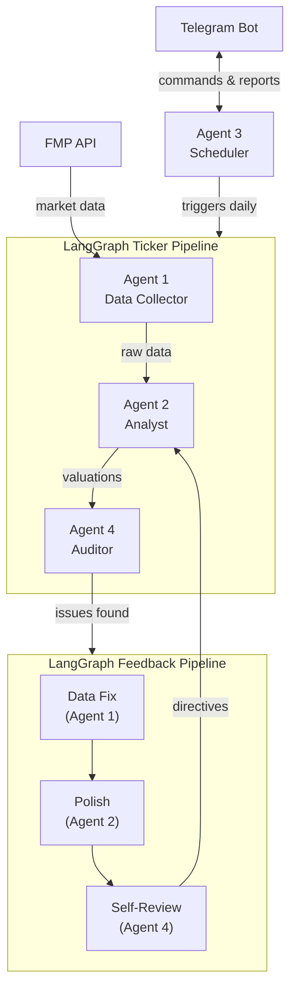

# Nexus

**A multi-agent AI system that automates institutional-grade equity research across the full S&P 500.**

---

## What It Does

Nexus is a production investment research system built on LangGraph that continuously monitors, values, and audits 507 S&P 500 stocks. Four specialized AI agents collaborate through orchestrated pipelines to collect financial data, generate DCF valuations, enforce data quality, and deliver actionable research — all accessible through a natural-language Telegram assistant.

---

## Key Highlights

| | |
|---|---|
| **Coverage** | Full S&P 500 (507 tickers from IVV ETF) |
| **Automation** | 10 daily scheduled jobs running autonomously |
| **Valuation** | 3-scenario DCF with Nexus Score (0–100) |
| **Quality** | 35-check automated audit per ticker |
| **Self-Improving** | Feedback loop refines analysis after every cycle |
| **Delivery** | Telegram bot with 27 natural-language commands |
| **Uptime** | Reserved VM deployment (always-on production) |

---

## Architecture

**Agent 1 — Data Collector** gathers financials, estimates, and market data from FMP API.
**Agent 2 — Analyst** builds 3-scenario DCF valuations and computes the Nexus Score (0–100).
**Agent 3 — Scheduler** orchestrates 10 daily/weekly jobs with catch-up logic and ETA reporting.
**Agent 4 — Auditor** runs a 35-check quality audit and triggers the self-improving feedback loop.

---

## Technology Stack

| Layer | Technology |
|---|---|
| Orchestration | LangGraph StateGraph, conditional edges, MemorySaver |
| Language | Python 3.11 |
| LLM | OpenAI gpt-4o-mini |
| Data | FMP API (Stable + v3) |
| Database | PostgreSQL with SQLAlchemy ORM |
| Scheduler | APScheduler (AsyncIOScheduler) |
| Delivery | Telegram Bot API |
| Deployment | Replit Reserved VM (always-on) |

---

## Live Demo

**Bot:** [agentic-framework.replit.app](https://agentic-framework.replit.app)

---

## Status

Production system running daily. Built with prompt engineering and LangGraph orchestration.

*Private full repo available upon request.*
